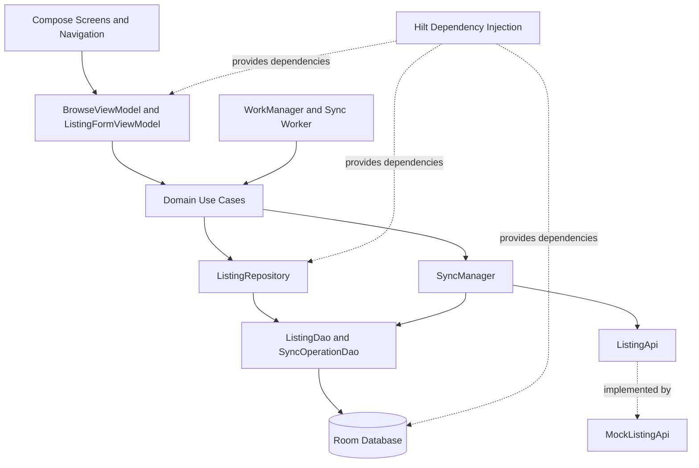

# OfflineMarketPlace

An Android marketplace application built with Kotlin and Jetpack Compose, designed to support offline listing management and synchronize pending changes when network connectivity becomes available.

## Features

* **Browse listings:** View marketplace listings in a scrollable grid.
* **Create listings:** Add new listings while offline.
* **Edit listings:** Modify existing listing details.
* **Favorite listings:** Mark or unmark listings as favorites.
* **Offline-first storage:** Store listing data locally using Room.
* **Pending synchronization:** Track offline changes using a local sync-operation queue.
* **Background synchronization:** Use WorkManager to schedule synchronization subject to network constraints.
* **Conflict protection:** Check whether a listing has changed locally before applying a server response.
* **Reactive UI:** Observe listing data and UI state through Kotlin Flows and StateFlow.
* **Dependency injection:** Use Hilt to manage dependencies.
* **Navigation:** Separate browsing and listing-form screens using Compose navigation.

## Technology Stack

| Technology         | Purpose                      |
| ------------------ | ---------------------------- |
| Kotlin             | Primary programming language |
| Jetpack Compose    | Declarative UI               |
| Material 3         | UI components and styling    |
| Room               | Local database persistence   |
| Kotlin Coroutines  | Asynchronous operations      |
| Flow and StateFlow | Reactive data and UI state   |
| Hilt               | Dependency injection         |
| WorkManager        | Background synchronization   |
| Navigation Compose | Screen navigation            |

## Architecture

The application follows a layered architecture with separate presentation, domain, and data responsibilities.

* **Presentation layer:** Compose screens, navigation, ViewModels, and UI state.
* **Domain layer:** Use cases representing listing operations and synchronization actions.
* **Data layer:** Repository, Room DAOs, local entities, and remote API abstraction.
* **Synchronization layer:** SyncManager processes queued CREATE and UPDATE operations.
* **Background processing:** WorkManager schedules synchronization when configured constraints are met.

### Architecture Diagram



## Offline Synchronization

When a user creates or modifies a listing, the application saves the change locally and records a pending synchronization operation.

When synchronization runs:

1. Pending operations are retrieved from Room.
2. The current local listing is loaded.
3. The appropriate API operation is executed.
4. The server response is applied only if the local listing has not changed since it was sent.
5. The completed operation is removed from the pending queue if the conditional local update succeeds.
6. Failed requests can be retried when the worker is configured to return a retry result.

### Synchronization Flow

```
sequenceDiagram
    actor User
    participant UI as Compose UI
    participant VM as ViewModel
    participant UC as Use Case
    participant Repo as Repository
    participant Room as Room Database
    participant Sync as SyncManager
    participant API as ListingApi

    User->>UI: Create or edit listing
    UI->>VM: Submit changes
    VM->>UC: Execute use case
    UC->>Repo: Save local changes
    Repo->>Room: Save listing and queue operation
    Room-->>UI: Updated observable data

    Note over Sync,API: Synchronization runs when triggered

    Sync->>Room: Read pending operations
    Room-->>Sync: Pending operations
    Sync->>API: Send CREATE or UPDATE
    API-->>Sync: Server response
    Sync->>Room: Conditional local update

    alt Local listing unchanged
        Sync->>Room: Delete completed operation
    else Local listing changed
        Note over Sync,Room: Keep operation pending
    end
```

## Memory and CPU Considerations

* Use `LazyVerticalGrid` for listing collections so only visible items and required nearby items are composed.
* Observe database data through Flow instead of repeatedly loading entire datasets on the main thread.
* Use `StateFlow` and a consolidated `BrowseUiState` to expose screen state.
* Perform database and network operations in suspend functions and coroutines.
* Use WorkManager constraints to avoid unnecessary synchronization attempts when network connectivity is unavailable.
* Keep pending synchronization operations in Room so they survive process termination and device restarts.
* Avoid unnecessary copies of large listing collections and unnecessary work during recomposition.
* Consider pagination if the marketplace grows beyond the current dataset.
* Measure actual CPU usage, memory consumption, and frame rendering performance before making performance claims.

## Project Setup

### Prerequisites

* Android Studio
* A compatible JDK and Android SDK
* Gradle wrapper included in the project

### Build

On Windows, run the following from the project root:

```powershell
.\gradlew.bat assembleDebug
```

To install the debug build on a connected device:

```powershell
.\gradlew.bat installDebug
```

### Run

1. Open the project in Android Studio.
2. Allow Gradle synchronization to complete.
3. Run the application on an emulator or Android device.
4. Test listing creation, editing, favorites, and synchronization with network connectivity disabled and restored.

## Current API Implementation

The project currently uses `MockListingApi`, an in-memory mock implementation of `ListingApi`. It is useful for demonstrating and testing offline synchronization without requiring a production backend.

Because the mock API stores data in memory, its server-side state is reset when its process or instance is recreated. A production implementation should use a persistent backend and define appropriate retry, idempotency, and conflict-resolution policies.

## Future Improvements

* Add Room transactions for related local listing and sync-queue updates.
* Add automated unit and integration tests for repository and synchronization behavior.
* Add explicit migration strategies and schema export for database upgrades.
* Add server-side idempotency for retry-safe CREATE operations.
* Add more robust conflict resolution for concurrent edits.
* Add pagination and performance profiling for larger datasets.
